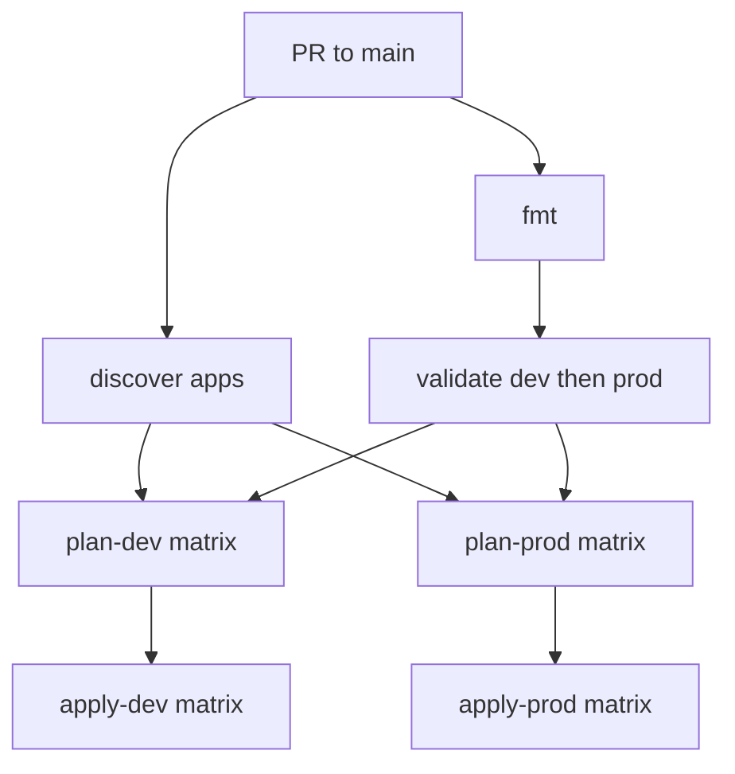
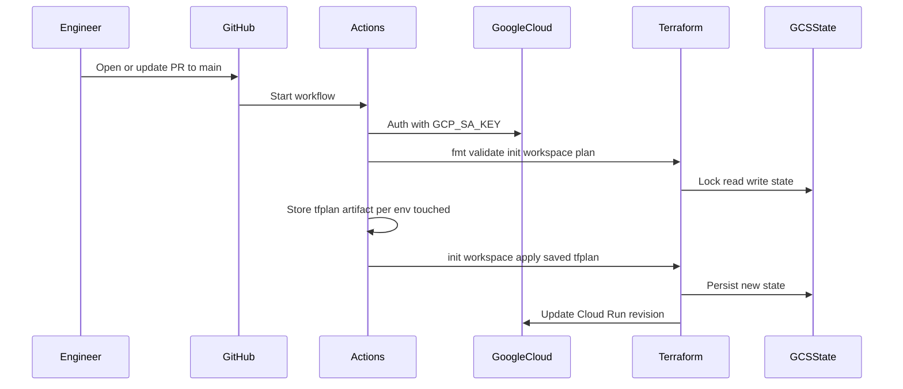

# freestar

A **showcase blueprint** for deploying **Google Cloud Run** with **Terraform** and **GitHub Actions**: predictable structure, **remote state in GCS**, **separate dev/prod workspaces**, **reviewable tfvars per app**, and a CI pipeline that **plans before it applies** using a **saved plan file**.

---

## Why this exists

| Goal | How this repo addresses it |
|------|----------------------------|
| **Repeatable deploys** | One root module + a small `cloud_run_app` module; lock file committed for provider versions. |
| **Environment isolation** | Terraform workspaces **`dev`** and **`prod`** with state objects under one GCS **`prefix`** (the GCS backend does not support S3’s `workspace_key_prefix`; each workspace is a separate object under that prefix). |
| **Clear ownership of config** | Each app uses **`common.tfvars`** (shared) + **`dev.tfvars` / `prod.tfvars`** (env-specific); PRs show exactly what changes per environment. |
| **Safer automation** | GitHub Actions runs **fmt → validate → plan → apply**; **apply** uses only the **plan artifact**. **No `workflow_dispatch`**. **Every app** under **`apps/*/`** gets **dev** and **prod** plan/apply on each qualifying PR (path-filtered). |
| **No secrets in source** | **`backend.tf`** declares `backend "gcs" {}` only; **bucket / prefix** are supplied at **`terraform init`** via **`TF_STATE_BUCKET`** (and a fixed prefix in `scripts/terraform.sh`). |
| **Operational guardrails** | **Workflow concurrency** queues overlapping runs per **repository + app + Terraform workspace** so different apps under `apps/` do not block each other. |

---

## What’s included

- **Terraform** — Cloud Run **v2** service, optional **VPC connector**, optional **public** access via `INGRESS_TRAFFIC_ALL` + `roles/run.invoker` for `allUsers` when enabled.
- **`scripts/terraform.sh`** — **init** from **`TF_STATE_BUCKET`**; GCS **`prefix`** is **`freestar`** in-script. **Workspace select**, **fmt / validate / plan / apply**. **GitHub Actions calls this script** for Terraform steps so CI matches local usage.
- **`.github/workflows/terraform.yml`** — **PRs to `main`** (path-filtered). Lists app folders under **`apps/`**, then **fmt** once, **validate** once (dev + prod workspaces), then **matrix plan/apply** for **each app** × **dev** and **prod**. **Fork PRs** run **discover + fmt** only (no GCP).
- **Example app** — `apps/example-api/` with **common + dev + prod** tfvars (illustrative `project_id` and image; adjust for your GCP project).

---

## End-to-end flow


---

## CI job chain

**discover** lists subdirectories of **`apps/`** (the workflow expects at least one app folder). **fmt** runs on the repo. **validate** runs the **shared root module** in workspace **dev**, then **prod** (no per-app matrix — tfvars are only needed at plan). **plan-dev** and **plan-prod** each use a **matrix over apps** and upload **`tfplan-<app>-dev`** / **`tfplan-<app>-prod`**. **apply-*** downloads the matching artifact and applies.



**Concurrency:** `cancel-in-progress: false`; **`terraform-<repo>-validate`** for the single validate job; **`terraform-<repo>-<app>-dev`** / **`-prod`** for plan/apply so apps do not share queues.

---

## How state, workspaces, and tfvars line up

```mermaid
flowchart TB
  subgraph files [Var files]
    common[common.tfvars]
    devTf[dev.tfvars]
    prodTf[prod.tfvars]
  end
  subgraph tf [Terraform]
    root[Root module]
    mod[modules/cloud_run_app]
  end
  subgraph backend [GCS backend]
    bucket[(Bucket)]
    prefix[prefix e.g. freestar]
    stateDev[object for workspace dev]
    stateProd[object for workspace prod]
  end
  common --> root
  devTf -->|"workspace dev"| root
  prodTf -->|"workspace prod"| root
  root --> mod
  bucket --> prefix
  prefix --> stateDev
  prefix --> stateProd
```



**Bootstrap once** (not done in CI): after the first successful **`terraform init`** against the real bucket, create workspaces:

```bash
terraform workspace new dev
terraform workspace new prod
```

---

## Repository layout

| Path | Role |
|------|------|
| `main.tf`, `variables.tf`, `outputs.tf`, `versions.tf` | Root module wiring |
| `backend.tf` | Partial **`backend "gcs" {}`** — credentials for state come from ADC / init flags, not hard-coded bucket names |
| `modules/cloud_run_app/` | Cloud Run v2, **`google_service_account`** for the runtime identity (id = **`{service_name}-runtime-{workspace}`**), optional VPC, optional **`allUsers`** invoker |
| `apps/<app>/common.tfvars` | Shared inputs for that app |
| `apps/<app>/dev.tfvars`, `prod.tfvars` | Per-environment overrides |
| `scripts/terraform.sh` | Wrapper used **locally and in CI** for init / workspace / fmt / validate / plan / apply |
| `.github/workflows/terraform.yml` | **One workflow** — discover **`apps/*/`**, fmt, validate, matrix plan/apply per app |
| `.terraform.lock.hcl` | **Commit this** so everyone resolves the same provider versions |

---

## Local usage

1. **Application Default Credentials** must see the state bucket (e.g. `gcloud auth application-default login` or `GOOGLE_APPLICATION_CREDENTIALS`).
2. Export **`TF_STATE_BUCKET`** (required). The script uses GCS prefix **`freestar`** (hardcoded; change it in **`scripts/terraform.sh`** if your layout differs).
3. Ensure workspaces **`dev`** and **`prod`** exist in the backend.
4. Run the script (example for **dev**):

```bash
export TF_STATE_BUCKET=your-bucket
./scripts/terraform.sh fmt
./scripts/terraform.sh validate --workspace dev
./scripts/terraform.sh plan --workspace dev \
  --var-file apps/example-api/common.tfvars \
  --var-file apps/example-api/dev.tfvars
./scripts/terraform.sh apply --workspace dev
```

---

## GitHub setup

Create **Environments** named **`dev`** and **`prod`** (they align with workspace names and `dev.tfvars` / `prod.tfvars`).

| Type | Name | Purpose |
|------|------|---------|
| Secret | `GCP_SA_KEY` | JSON key for the deploy SA. **Repository** or **organization** secret so **validate** / **plan** (no environment) can auth; you may also set it on **`dev`** / **`prod`** for apply-only overrides. |
| Variable | `TF_STATE_BUCKET` | State bucket. Same idea: **repository** / **org** for validate/plan; optional **environment** values for apply if needed. |

### Environment approvals

Use GitHub deployment gates so **apply** waits for a human. In the repo open **Settings → Environments**, choose **`dev`** and **`prod`**, and set **Environment protection rules** (for example **Required reviewers**, or **Wait timer** / **Deployment branches** if those fit your process). See [Using environments for deployment](https://docs.github.com/en/actions/deployment/targeting-different-environments/using-environments-for-deployment).

In **`.github/workflows/terraform.yml`**, only **apply-dev** and **apply-prod** declare **`environment: dev`** or **`environment: prod`**. **validate** and **plan-*** jobs do **not** use an environment, so they run without that gate and **plans complete before anyone is asked to approve**. Put **`GCP_SA_KEY`** and **`TF_STATE_BUCKET`** at **repository** or **organization** scope so validate/plan can read them; you can still keep **environment-specific** secrets or variables on **`dev`** / **`prod`** for apply if you want them to differ from the repo defaults.

**Another app:** add **`apps/<name>/`** with **`common.tfvars`**, **`dev.tfvars`**, and **`prod.tfvars`**. The workflow picks it up automatically on the next PR. This root module still uses **one GCS prefix** (`**freestar**` in **`scripts/terraform.sh`**); use separate state/backends if apps must not share Terraform state.

---

## Deploy and runtime service accounts

CI and local Terraform authenticate as the **deploy** service account (**`GCP_SA_KEY`**). The **`cloud_run_app`** module creates a separate **runtime** **`google_service_account`** used as the Cloud Run revision identity. Its **`account_id`** is **`{service_name}-runtime-{terraform.workspace}`** (service name normalized to lowercase with underscores as hyphens, truncated to 30 characters). Emails are in **`terraform output`** (`runtime_service_account_email`, `runtime_service_account_id`).

**Deploy** SA needs, in the target project (and on state in GCS): permission to read/write state; to manage Cloud Run (e.g. **`roles/run.admin`**); to create service accounts (**`roles/iam.serviceAccountAdmin`** or **`roles/iam.serviceAccountCreator`**); and **Service Account User** (**`roles/iam.serviceAccountUser`**) on **each** runtime SA the module creates (dev and prod workspaces each have their own runtime SA). Use **Artifact Registry** reader and any VPC-related roles if your tfvars require them.

**Project IAM for logging and metrics** on the runtime SA (**`roles/logging.logWriter`**, **`roles/monitoring.metricWriter`**) is **not** defined in this repo (that would require project-level IAM admin on the deploy identity). Grant those bindings separately per runtime account if you want default Cloud Logging / Cloud Monitoring behavior for the workload, for example:

```bash
RUNTIME_SA="$(terraform output -raw runtime_service_account_email)"
PROJECT="your-project-id"
gcloud projects add-iam-policy-binding "$PROJECT" \
  --member="serviceAccount:${RUNTIME_SA}" --role="roles/logging.logWriter"
gcloud projects add-iam-policy-binding "$PROJECT" \
  --member="serviceAccount:${RUNTIME_SA}" --role="roles/monitoring.metricWriter"
```

---

## Configurable inputs (root / tfvars)

| Area | Notes |
|------|--------|
| **Service** | `project_id`, `region`, `service_name` (also drives runtime SA id), `image`, `container_port`, `cpu`, `memory`, `labels` |
| **Networking** | `ingress`; optional **`vpc_connector`**, **`vpc_egress`** (`PRIVATE_RANGES_ONLY` / `ALL_TRAFFIC`) |
| **Public HTTP** | When **`allow_unauthenticated`** is true and ingress allows external traffic, the module grants **`roles/run.invoker`** to **`allUsers`** |
| **Identity** | Runtime SA **`{service_name}-runtime-{workspace}`** (derived from **`service_name`**; module creates it) |

---

## Sequence: one successful apply from Actions



---

## Possible next steps

- **Lint `.tf` and check `tfvars`** — **tflint** on root and `modules/`; for **`apps/*/*.tfvars`**, run tflint with **`--var-file`** (common + env) or add **checkov** / policy-as-code in CI alongside **`terraform fmt`** and **`terraform validate`**.
- **Workload Identity Federation** instead of long-lived JSON keys for GitHub → GCP.
- **Atlantis** or similar for a dedicated plan/apply UI and policy hooks.
- **CODEOWNERS** on `modules/**` and per-app `apps/` paths (complements environment approvals above).
- A **staging** workspace and `staging.tfvars` when you need a third environment.
- **Authenticated endpoints** — turn off public `allUsers` invoke, use **`INGRESS_TRAFFIC_INTERNAL_ONLY`** (or load-balancer ingress), grant **`roles/run.invoker`** to specific principals or groups, and require **Identity-Aware Proxy (IAP)** or **OAuth** at the edge if users hit the service via browser.
- **DNS and load balancer integration** — front Cloud Run with a **Global external HTTP(S) load balancer** (or **Cloud Load Balancing** + **serverless NEG**), attach a **managed SSL certificate**, wire **Cloud DNS** (or your DNS provider) to the LB IP or **Cloud Load Balancing** hostname, and align **Cloud Run ingress** with “internal and load balancing” patterns so traffic flows LB → serverless backend → revision.

---

This repository is intended as a **reference implementation** you can copy, trim, or extend to match your org’s naming, IAM, and compliance rules.
