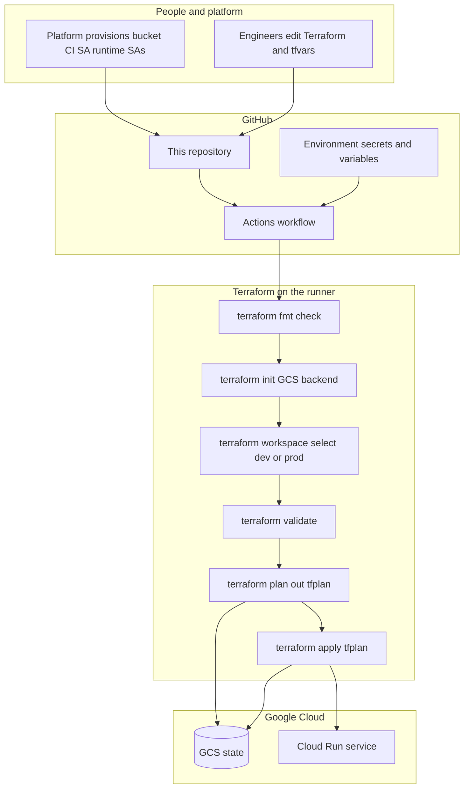
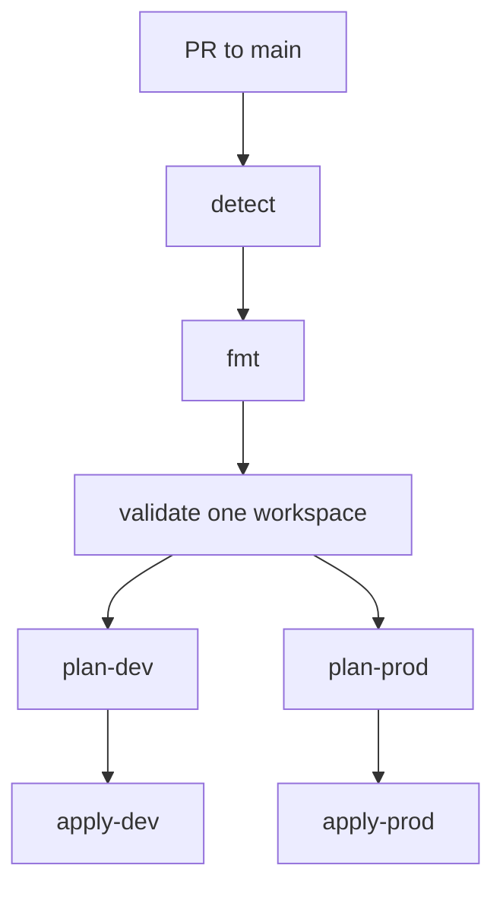
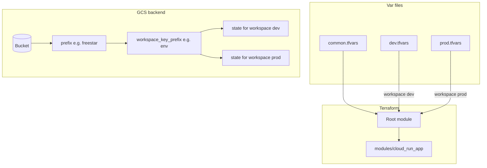
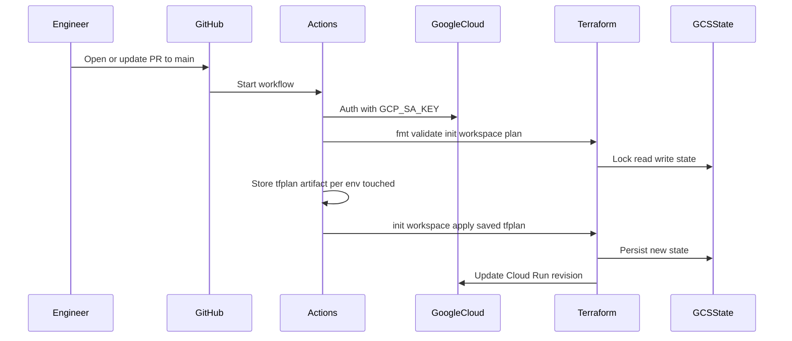

# freestar

A **showcase blueprint** for deploying **Google Cloud Run** with **Terraform** and **GitHub Actions**: predictable structure, **remote state in GCS**, **separate dev/prod workspaces**, **reviewable tfvars per app**, and a CI pipeline that **plans before it applies** using a **saved plan file**.

---

## Why this exists

| Goal | How this repo addresses it |
|------|----------------------------|
| **Repeatable deploys** | One root module + a small `cloud_run_app` module; lock file committed for provider versions. |
| **Environment isolation** | Terraform workspaces **`dev`** and **`prod`** with state stored under a single GCS stack prefix + `workspace_key_prefix`. |
| **Clear ownership of config** | Each app uses **`common.tfvars`** (shared) + **`dev.tfvars` / `prod.tfvars`** (env-specific); PRs show exactly what changes per environment. |
| **Safer automation** | GitHub Actions runs **fmt → validate → plan → apply**; **apply** uses only the **plan artifact**. **No `workflow_dispatch` inputs** — which app and which workspaces run follow the **PR diff** and repo variable **`TF_APP`**. |
| **No secrets in source** | **`backend.tf`** declares `backend "gcs" {}` only; **bucket / prefix** are supplied at **`terraform init`** (env vars in CI, or `--backend-config` locally). |
| **Operational guardrails** | **Workflow concurrency** queues overlapping runs for the same app+environment so two applies do not fight the same state. |

---

## What’s included

- **Terraform** — Cloud Run **v2** service, optional **VPC connector**, optional **public** access via `INGRESS_TRAFFIC_ALL` + `roles/run.invoker` for `allUsers` when enabled.
- **`scripts/terraform.sh`** — Local **init** (from `TF_STATE_*` env or `--backend-config`), **workspace select**, **validate / plan / apply**.
- **`.github/workflows/terraform.yml`** — **Pull requests to `main` only** (path-filtered). A **detect** job chooses **dev**, **prod**, or **both** from the diff; **fork PRs** run **detect + fmt** only (no GCP).
- **Example app** — `apps/example-api/` with **common + dev + prod** tfvars (illustrative project IDs and runtime SA names you can replace).

---

## End-to-end flow



---

## CI job chain

After **detect** (diff against the PR base) and **fmt**, **validate** runs once against either workspace **`dev`** or **`prod`** (whichever the detect step picks for a quick syntax check). **plan-dev** / **plan-prod** run in **parallel** when the diff touches shared Terraform, **`common.tfvars`**, or the matching **`dev.tfvars`** / **`prod.tfvars`** for **`TF_APP`**. Each plan uploads **`tfplan-dev`** or **`tfplan-prod`**; the matching **apply** job downloads that file and runs **`terraform apply tfplan`** only.



**Concurrency:** `cancel-in-progress: false`; groups are **per repository + app + environment** (`dev` vs `prod`), plus a **validate** group keyed by PR number so overlapping pushes queue instead of fighting state.

---

## How state, workspaces, and tfvars line up



**Bootstrap once** (not done in CI): after the first successful **`terraform init`** against the real bucket, create workspaces:

```bash
terraform workspace new dev
terraform workspace new prod
```

---

## Repository layout

| Path | Role |
|------|------|
| `main.tf`, `variables.tf`, `outputs.tf`, `versions.tf` | Root module wiring |
| `backend.tf` | Partial **`backend "gcs" {}`** — credentials for state come from ADC / init flags, not hard-coded bucket names |
| `modules/cloud_run_app/` | Cloud Run v2 + optional VPC + optional public IAM |
| `apps/<app>/common.tfvars` | Shared inputs for that app |
| `apps/<app>/dev.tfvars`, `prod.tfvars` | Per-environment overrides |
| `scripts/terraform.sh` | Local wrapper around init / workspace / validate / plan / apply |
| `.github/workflows/terraform.yml` | Full CI pipeline |
| `.terraform.lock.hcl` | **Commit this** so everyone resolves the same provider versions |

---

## Local usage

1. **Application Default Credentials** must see the state bucket (e.g. `gcloud auth application-default login` or `GOOGLE_APPLICATION_CREDENTIALS`).
2. Export **`TF_STATE_BUCKET`** (required). Optional: **`TF_STATE_PREFIX_BASE`** (default `freestar`), **`TF_WORKSPACE_KEY_PREFIX`** (default `env`).
3. Ensure workspaces **`dev`** and **`prod`** exist in the backend.
4. Run the script (example for **dev**):

```bash
export TF_STATE_BUCKET=your-bucket
./scripts/terraform.sh fmt
./scripts/terraform.sh validate --workspace dev
./scripts/terraform.sh plan --workspace dev \
  --var-file apps/example-api/common.tfvars \
  --var-file apps/example-api/dev.tfvars
./scripts/terraform.sh apply --workspace dev
```

You can still pass **`--backend-config /path/to/backend.hcl`** instead of `TF_STATE_*` if you prefer a file for init.

---

## GitHub setup

Create **Environments** named **`dev`** and **`prod`** (they align with workspace names and `dev.tfvars` / `prod.tfvars`).

| Type | Name | Purpose |
|------|------|---------|
| Secret | `GCP_SA_KEY` | JSON key for the deploy service account (replace with WIF when ready) |
| Variable | `TF_STATE_BUCKET` | State bucket |
| Variable | `TF_STATE_PREFIX_BASE` | Optional; default `freestar` in workflow |
| Variable | `TF_WORKSPACE_KEY_PREFIX` | Optional; default `env` in workflow |

**Repository variable** (optional): **`TF_APP`** — folder under `apps/` (default **`example-api`**). The workflow uses it with the PR diff to decide **dev** / **prod** / **both**; there is no manual “pick environment” input on dispatch.

---

## Deploy service account (typical permissions)

- Read/write objects for your state **prefix** in the GCS bucket.
- Manage Cloud Run in the target **project_id** (from tfvars).
- **Service Account User** on the **runtime** service account referenced in tfvars.
- **Artifact Registry** reader if images are private.
- VPC / connector usage if you set **`vpc_connector`**.

---

## Configurable inputs (root / tfvars)

| Area | Notes |
|------|--------|
| **Service** | `project_id`, `region`, `service_name`, `image`, `container_port`, `cpu`, `memory`, `labels` |
| **Networking** | `ingress`; optional **`vpc_connector`**, **`vpc_egress`** (`PRIVATE_RANGES_ONLY` / `ALL_TRAFFIC`) |
| **Public HTTP** | **`allow_unauthenticated`** with **`INGRESS_TRAFFIC_ALL`** (example-api enables this); org policy may block `allUsers` |
| **Identity** | **`runtime_service_account_email`** (must exist in GCP) |

---

## Sequence: one successful apply from Actions



---

## Possible next steps

- **Workload Identity Federation** instead of long-lived JSON keys for GitHub → GCP.
- **Atlantis** or similar for a dedicated plan/apply UI and policy hooks.
- **GitHub Environment protection rules** and **CODEOWNERS** on `modules/**` and per-app `apps/` paths.
- A **staging** workspace and `staging.tfvars` when you need a third environment.
- **Authenticated endpoints** — turn off public `allUsers` invoke, use **`INGRESS_TRAFFIC_INTERNAL_ONLY`** (or load-balancer ingress), grant **`roles/run.invoker`** to specific principals or groups, and require **Identity-Aware Proxy (IAP)** or **OAuth** at the edge if users hit the service via browser.
- **DNS and load balancer integration** — front Cloud Run with a **Global external HTTP(S) load balancer** (or **Cloud Load Balancing** + **serverless NEG**), attach a **managed SSL certificate**, wire **Cloud DNS** (or your DNS provider) to the LB IP or **Cloud Load Balancing** hostname, and align **Cloud Run ingress** with “internal and load balancing” patterns so traffic flows LB → serverless backend → revision.

---

This repository is intended as a **reference implementation** you can copy, trim, or extend to match your org’s naming, IAM, and compliance rules.
